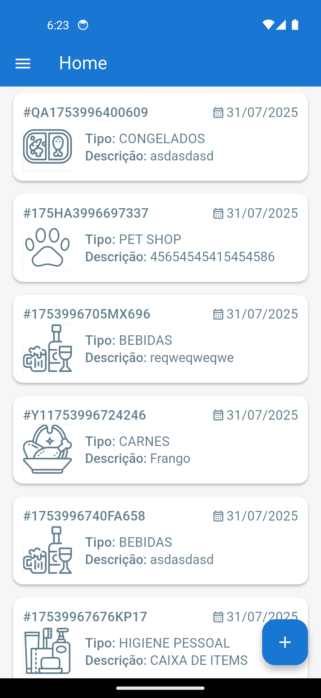

# Registrado-APP

#### Aplicativo de Gerenciamento de Mercadorias Avariadas e Vencidas

Um aplicativo desenvolvido para facilitar o controle de mercadorias danificadas ou fora do prazo de validade. 
Com funcionalidades intuitivas para registro, catalogação e acompanhamento de itens comprometidos, o app garante maior rastreabilidade, organização e eficiência no gerenciamento de estoque. 
Ideal para supermercados, distribuidoras e centros de logística, o sistema ajuda a reduzir perdas, agilizar relatórios e garantir conformidade com boas práticas de gestão.

### 🖼️ Visual do Aplicativo

Abaixo, veja um exemplo da interface do aplicativo:

